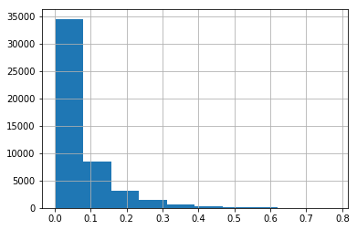

```python
from xgboost.sklearn import XGBClassifier
from sklearn.model_selection import cross_val_score
from sklearn.model_selection import StratifiedKFold
from sklearn.linear_model import LogisticRegression
from sklearn.neighbors import KNeighborsClassifier
from sklearn.model_selection import GridSearchCV
from sklearn.ensemble import AdaBoostClassifier
from sklearn.pipeline import Pipeline
from sklearn.preprocessing import Imputer
from sklearn.preprocessing import LabelEncoder
from sklearn.metrics import roc_auc_score
```


```python
from json import load
import os
import pandas as pd
import numpy as np
```


```python
cd '/projects/home-credit-default-risk/'
```

    /projects/home-credit-default-risk


```python
from src import utils, proj_utils
```

# Load training data


```python
%%time
# Load dataframe.
df = proj_utils.load_data(train = True,
                     supp_dict = {'previous_application.csv.zip' : 'max',
                                  'credit_card_balance.csv.zip' : 'mean',
                                  'installments_payments.csv.zip' : 'min',
                                  'POS_CASH_balance.csv.zip' : 'mean',
                                  'bureau.csv.zip' : 'max'
                                 })
```

    Loading training applications
    Loading previous_application.csv.zip
    Loading credit_card_balance.csv.zip
    Loading installments_payments.csv.zip
    Loading POS_CASH_balance.csv.zip
    Loading bureau.csv.zip
    CPU times: user 2min 13s, sys: 22.4 s, total: 2min 35s
    Wall time: 1min 43s


```python
%%time
# Load dataframe.
df_test = proj_utils.load_data(train = False,
                     supp_dict = {'previous_application.csv.zip' : 'max',
                                  'credit_card_balance.csv.zip' : 'mean',
                                  'installments_payments.csv.zip' : 'min',
                                  'POS_CASH_balance.csv.zip' : 'mean',
                                  'bureau.csv.zip' : 'max'
                                 })
```

    Loading test applications
    Loading previous_application.csv.zip
    Loading credit_card_balance.csv.zip
    Loading installments_payments.csv.zip
    Loading POS_CASH_balance.csv.zip
    Loading bureau.csv.zip
    CPU times: user 2min 2s, sys: 17.9 s, total: 2min 20s
    Wall time: 1min 32s


```python
%%time
# Create design matrix
features = [x for x in df.columns if x != 'TARGET' and x != 'SK_ID_CURR']
X,y = utils.get_design_matrix_lbl(df, 'TARGET', features, convert_categorical = True)
```

    /root/anaconda3/lib/python3.6/site-packages/pandas/core/indexing.py:543: SettingWithCopyWarning: 
    A value is trying to be set on a copy of a slice from a DataFrame.
    Try using .loc[row_indexer,col_indexer] = value instead
    
    See the caveats in the documentation: http://pandas.pydata.org/pandas-docs/stable/indexing.html#indexing-view-versus-copy
      self.obj[item] = s


    CPU times: user 14.8 s, sys: 3.09 s, total: 17.9 s
    Wall time: 5.9 s


```python
X_test = utils.get_design_matrix_lbl(df_test, features = features, convert_categorical = True)
```

    /root/anaconda3/lib/python3.6/site-packages/pandas/core/indexing.py:543: SettingWithCopyWarning: 
    A value is trying to be set on a copy of a slice from a DataFrame.
    Try using .loc[row_indexer,col_indexer] = value instead
    
    See the caveats in the documentation: http://pandas.pydata.org/pandas-docs/stable/indexing.html#indexing-view-versus-copy
      self.obj[item] = s


```python
kfold = StratifiedKFold(n_splits = 5, random_state = 123)
```

# Preprocess design matrix


```python
from sklearn.preprocessing import FunctionTransformer
```


```python
# Impute outliers
def clean_columns(data, m = 3):
    return np.apply_along_axis(null_outliers , 0, data, **{'m':m})

def null_outliers(x, m):
    z = (x - np.nanmean(x))/np.nanstd(x)
    outliers = abs(z) > m
    x[abs(z) > m] = np.nan
    return x

pipe_clean_columns = FunctionTransformer(func = clean_columns, validate= False)
```

# Build initial model


```python
from lightgbm import LGBMClassifier

categorical_columns = list(df.columns[df.dtypes == object])
categorical_feature = 'name:' + ','.join(categorical_columns)

params = {'boosting_type': 'gbdt',
          'max_depth' : -1,
          'objective': 'binary',
          'learning_rate': 0.0212,
          'reg_alpha': 0.8,
          'reg_lambda': 0.4,
          'subsample': 1,
          'feature_fraction': 0.3,
          'device_type': 'gpu',
          'metric' : 'auc',
          'random_state': 123,
          'n_estimators': 1313, 
          'num_leaves': 40, 
          'max_bin': 255,
          'min_data_in_leaf': 2400,
          'min_data_in_bin': 5}

clf = LGBMClassifier(**params)
```


```python
model_1 = Pipeline([('outlier_detection', pipe_clean_columns),
                    ('clf', clf)])
```


```python
score_1 = cross_val_score(model_1, X, y, scoring = 'roc_auc', cv = kfold)
```

    /root/anaconda3/lib/python3.6/site-packages/ipykernel_launcher.py:7: RuntimeWarning: invalid value encountered in greater
      import sys
    /root/anaconda3/lib/python3.6/site-packages/ipykernel_launcher.py:8: RuntimeWarning: invalid value encountered in greater
      
    /root/anaconda3/lib/python3.6/site-packages/ipykernel_launcher.py:6: RuntimeWarning: invalid value encountered in true_divide
      
    /root/anaconda3/lib/python3.6/site-packages/ipykernel_launcher.py:7: RuntimeWarning: invalid value encountered in greater
      import sys
    /root/anaconda3/lib/python3.6/site-packages/ipykernel_launcher.py:8: RuntimeWarning: invalid value encountered in greater
      
    /root/anaconda3/lib/python3.6/site-packages/ipykernel_launcher.py:6: RuntimeWarning: invalid value encountered in true_divide
      
    /root/anaconda3/lib/python3.6/site-packages/ipykernel_launcher.py:7: RuntimeWarning: invalid value encountered in greater
      import sys
    /root/anaconda3/lib/python3.6/site-packages/ipykernel_launcher.py:8: RuntimeWarning: invalid value encountered in greater
      
    /root/anaconda3/lib/python3.6/site-packages/ipykernel_launcher.py:6: RuntimeWarning: invalid value encountered in true_divide
      
    /root/anaconda3/lib/python3.6/site-packages/ipykernel_launcher.py:7: RuntimeWarning: invalid value encountered in greater
      import sys
    /root/anaconda3/lib/python3.6/site-packages/ipykernel_launcher.py:8: RuntimeWarning: invalid value encountered in greater
      
    /root/anaconda3/lib/python3.6/site-packages/ipykernel_launcher.py:6: RuntimeWarning: invalid value encountered in true_divide
      
    /root/anaconda3/lib/python3.6/site-packages/ipykernel_launcher.py:7: RuntimeWarning: invalid value encountered in greater
      import sys
    /root/anaconda3/lib/python3.6/site-packages/ipykernel_launcher.py:8: RuntimeWarning: invalid value encountered in greater
      
    /root/anaconda3/lib/python3.6/site-packages/ipykernel_launcher.py:6: RuntimeWarning: invalid value encountered in true_divide
      
    /root/anaconda3/lib/python3.6/site-packages/ipykernel_launcher.py:7: RuntimeWarning: invalid value encountered in greater
      import sys
    /root/anaconda3/lib/python3.6/site-packages/ipykernel_launcher.py:8: RuntimeWarning: invalid value encountered in greater
      
    /root/anaconda3/lib/python3.6/site-packages/ipykernel_launcher.py:6: RuntimeWarning: invalid value encountered in true_divide
      
    /root/anaconda3/lib/python3.6/site-packages/ipykernel_launcher.py:7: RuntimeWarning: invalid value encountered in greater
      import sys
    /root/anaconda3/lib/python3.6/site-packages/ipykernel_launcher.py:8: RuntimeWarning: invalid value encountered in greater
      
    /root/anaconda3/lib/python3.6/site-packages/ipykernel_launcher.py:6: RuntimeWarning: invalid value encountered in true_divide
      
    /root/anaconda3/lib/python3.6/site-packages/ipykernel_launcher.py:7: RuntimeWarning: invalid value encountered in greater
      import sys
    /root/anaconda3/lib/python3.6/site-packages/ipykernel_launcher.py:8: RuntimeWarning: invalid value encountered in greater
      
    /root/anaconda3/lib/python3.6/site-packages/ipykernel_launcher.py:6: RuntimeWarning: invalid value encountered in true_divide
      
    /root/anaconda3/lib/python3.6/site-packages/ipykernel_launcher.py:7: RuntimeWarning: invalid value encountered in greater
      import sys
    /root/anaconda3/lib/python3.6/site-packages/ipykernel_launcher.py:8: RuntimeWarning: invalid value encountered in greater
      
    /root/anaconda3/lib/python3.6/site-packages/ipykernel_launcher.py:6: RuntimeWarning: invalid value encountered in true_divide
      
    /root/anaconda3/lib/python3.6/site-packages/ipykernel_launcher.py:7: RuntimeWarning: invalid value encountered in greater
      import sys
    /root/anaconda3/lib/python3.6/site-packages/ipykernel_launcher.py:8: RuntimeWarning: invalid value encountered in greater
      
    /root/anaconda3/lib/python3.6/site-packages/ipykernel_launcher.py:6: RuntimeWarning: invalid value encountered in true_divide
      


```python
score_1.mean()
```


    0.7872314772568456


```python
model_1.fit(X, y)
```

    /root/anaconda3/lib/python3.6/site-packages/ipykernel_launcher.py:7: RuntimeWarning: invalid value encountered in greater
      import sys
    /root/anaconda3/lib/python3.6/site-packages/ipykernel_launcher.py:8: RuntimeWarning: invalid value encountered in greater
      
    /root/anaconda3/lib/python3.6/site-packages/ipykernel_launcher.py:6: RuntimeWarning: invalid value encountered in true_divide
      


    Pipeline(memory=None,
         steps=[('outlier_detection', FunctionTransformer(accept_sparse=False,
              func=<function clean_columns at 0x7f46bbf90048>,
              inv_kw_args=None, inverse_func=None, kw_args=None,
              pass_y='deprecated', validate=False)), ('clf', LGBMClassifier(boosting_type='gbdt', class_weight=Non...0.8, reg_lambda=0.4, silent=True, subsample=1,
            subsample_for_bin=200000, subsample_freq=0))])


# Select features


```python
model_1_importances = model_1.named_steps.clf.feature_importances_
```


```python
model_1_importances.shape
```


    (918,)


```python
kept_features = X.columns[model_1_importances > 1]
```


```python
kept_features.shape
```


    (457,)


```python
from mlxtend.feature_selection import ColumnSelector
```


```python
model_2 = Pipeline([('keep_features', ColumnSelector(kept_features)),
                    ('outlier_detection', pipe_clean_columns),
                    ('clf', clf)])
```


```python
score_2 = cross_val_score(model_2, X, y, scoring = 'roc_auc', cv = kfold)
```

    /root/anaconda3/lib/python3.6/site-packages/ipykernel_launcher.py:7: RuntimeWarning: invalid value encountered in greater
      import sys
    /root/anaconda3/lib/python3.6/site-packages/ipykernel_launcher.py:8: RuntimeWarning: invalid value encountered in greater
      
    /root/anaconda3/lib/python3.6/site-packages/ipykernel_launcher.py:7: RuntimeWarning: invalid value encountered in greater
      import sys
    /root/anaconda3/lib/python3.6/site-packages/ipykernel_launcher.py:8: RuntimeWarning: invalid value encountered in greater
      
    /root/anaconda3/lib/python3.6/site-packages/ipykernel_launcher.py:7: RuntimeWarning: invalid value encountered in greater
      import sys
    /root/anaconda3/lib/python3.6/site-packages/ipykernel_launcher.py:8: RuntimeWarning: invalid value encountered in greater
      
    /root/anaconda3/lib/python3.6/site-packages/ipykernel_launcher.py:7: RuntimeWarning: invalid value encountered in greater
      import sys
    /root/anaconda3/lib/python3.6/site-packages/ipykernel_launcher.py:8: RuntimeWarning: invalid value encountered in greater
      
    /root/anaconda3/lib/python3.6/site-packages/ipykernel_launcher.py:7: RuntimeWarning: invalid value encountered in greater
      import sys
    /root/anaconda3/lib/python3.6/site-packages/ipykernel_launcher.py:8: RuntimeWarning: invalid value encountered in greater
      
    /root/anaconda3/lib/python3.6/site-packages/ipykernel_launcher.py:7: RuntimeWarning: invalid value encountered in greater
      import sys
    /root/anaconda3/lib/python3.6/site-packages/ipykernel_launcher.py:8: RuntimeWarning: invalid value encountered in greater
      
    /root/anaconda3/lib/python3.6/site-packages/ipykernel_launcher.py:7: RuntimeWarning: invalid value encountered in greater
      import sys
    /root/anaconda3/lib/python3.6/site-packages/ipykernel_launcher.py:8: RuntimeWarning: invalid value encountered in greater
      
    /root/anaconda3/lib/python3.6/site-packages/ipykernel_launcher.py:7: RuntimeWarning: invalid value encountered in greater
      import sys
    /root/anaconda3/lib/python3.6/site-packages/ipykernel_launcher.py:8: RuntimeWarning: invalid value encountered in greater
      
    /root/anaconda3/lib/python3.6/site-packages/ipykernel_launcher.py:7: RuntimeWarning: invalid value encountered in greater
      import sys
    /root/anaconda3/lib/python3.6/site-packages/ipykernel_launcher.py:8: RuntimeWarning: invalid value encountered in greater
      
    /root/anaconda3/lib/python3.6/site-packages/ipykernel_launcher.py:7: RuntimeWarning: invalid value encountered in greater
      import sys
    /root/anaconda3/lib/python3.6/site-packages/ipykernel_launcher.py:8: RuntimeWarning: invalid value encountered in greater
      


```python
score_2.mean()
```


    0.7874550308784579


```python
model_2.fit(X,y)
```

    /root/anaconda3/lib/python3.6/site-packages/ipykernel_launcher.py:7: RuntimeWarning: invalid value encountered in greater
      import sys
    /root/anaconda3/lib/python3.6/site-packages/ipykernel_launcher.py:8: RuntimeWarning: invalid value encountered in greater
      


    Pipeline(memory=None,
         steps=[('keep_features', ColumnSelector(cols=Index(['NAME_CONTRACT_TYPE', 'CODE_GENDER', 'FLAG_OWN_CAR', 'FLAG_OWN_REALTY',
           'CNT_CHILDREN', 'AMT_INCOME_TOTAL', 'AMT_CREDIT', 'AMT_ANNUITY',
           'AMT_GOODS_PRICE', 'NAME_TYPE_SUITE',
           ...
           'CREDIT_TYPE_Microloan_mean', 'CREDIT_TYP...0.8, reg_lambda=0.4, silent=True, subsample=1,
            subsample_for_bin=200000, subsample_freq=0))])


# Produce submission


```python
y_hat = [x[1] for x in model_2.predict_proba(X_test)]
```

    /root/anaconda3/lib/python3.6/site-packages/ipykernel_launcher.py:7: RuntimeWarning: invalid value encountered in greater
      import sys
    /root/anaconda3/lib/python3.6/site-packages/ipykernel_launcher.py:8: RuntimeWarning: invalid value encountered in greater
      
    /root/anaconda3/lib/python3.6/site-packages/ipykernel_launcher.py:6: RuntimeWarning: invalid value encountered in true_divide
      


```python
submission = pd.DataFrame({'SK_ID_CURR': df_test.SK_ID_CURR,
                           'TARGET': y_hat})
```


```python
submission.TARGET.hist()
```


    <matplotlib.axes._subplots.AxesSubplot at 0x7f46b0c1f198>





```python
submission.to_csv('submission_15.csv', index = False)
```
